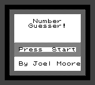
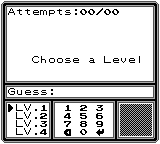

# NumberGuesserGB

NumberGuesserGB is a number guessing game written in 8bit assembly for the Nintendo Gameboy.

 

---

## Download

[Download on itch.io](https://joelmoore24.itch.io/numberguessergb)

## How to play

Simply guess a number between 1 and 99 then use the hints to narrow down your guess before you run out of chances.

---

## Playing the game

The game should work when loaded with most emulators.

The game has been tested on.

* VisualBoy
* Emulicious
* SameBoy
* Gameboy
* Gameboy Pocket
* Gameboy Color

The game is controlled using:

* **A** for selection
* **B** for back
* **DPAD** for navigation

---

## Contact

Joel Buchheim-Moore => <joelbm24@gmail.com>
